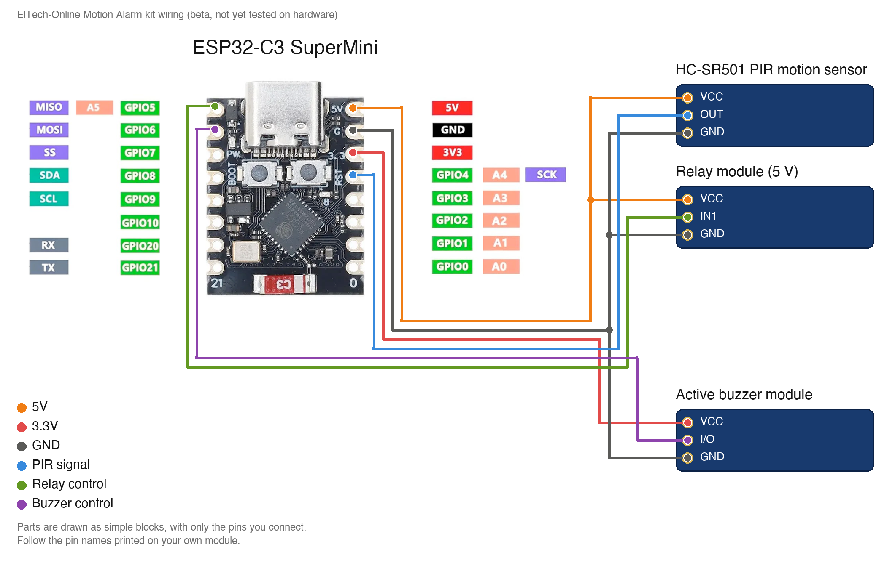

# ElTech-Online ESP32-C3 Motion Alarm

[](https://buymeacoffee.com/eltech)

> **Status: BETA, not tested.** The code compiles for the ESP32-C3, but this kit has not been built and tested on real hardware yet. Pin choices, default values and the wiring may still change. Use it to read and learn from; expect to do some fault-finding if you build it now.

A beginner-friendly **learning kit**: build a motion alarm from an **ESP32-C3 SuperMini**, an **HC-SR501 PIR motion sensor**, a **relay module** and an **active buzzer module**. When the sensor sees movement the buzzer sounds and the relay switches. You arm and disarm it from the web page the board hosts. No prior electronics or coding experience needed, and no soldering: everything plugs into a breadboard.

Designed, coded and documented by ElTech-Online in Callander, Scotland — the kit design, firmware and this guide are our own work.


## What you'll learn

The two halves of almost every electronics project:

- **Digital input** — reading a sensor whose output is simply HIGH or LOW
- **Switching a load** — using a relay and a transistor to switch things the board could never drive itself
- **Active-low signals** — parts that turn ON when their pin is LOW, and how to write code that doesn't care
- **Controlling hardware from a web page** — arm, disarm and switch the relay from your phone

Along the way you'll also pick up:

- **A state machine** — the alarm is always in exactly one state (warming up, disarmed, exit delay, armed, alarm)
- **An event log** kept in a ring buffer
- **Saving settings in flash memory**

The code is written to be read: every section is commented in plain language, and [How the code works](#how-the-code-works) walks through it.

## How the parts work

**The PIR sensor.** Everything warm gives off infrared light. Behind the white dome are two infrared detectors side by side; when a warm body moves across, one sees it before the other and the module's chip sets its OUT pin HIGH. It needs about a minute after power-on to settle, and it can't see through glass. The two orange adjusters set the range (`Sx`) and how long OUT stays HIGH (`Tx`).

**The relay.** A relay is a switch worked by an electromagnet. A small current through its coil pulls a metal contact across, and that contact can switch a completely separate circuit. The module has a transistor (and usually an opto-isolator) so a GPIO pin can work the coil. You will hear it click.

**The buzzer.** An *active* buzzer makes its tone by itself whenever it has power. The module has a transistor on board and is printed "Low level trigger": it sounds when its I/O pin is LOW.

> **Safety:** use the relay for **low-voltage circuits only** (battery or USB powered things, up to 24 V). Do not connect mains electricity to this kit.

## What it does

- Warms up for 60 seconds, then waits disarmed
- **Arm** gives you a 10 second exit delay (with ticks) before it is live
- Motion while armed: buzzer beeps and the relay switches for the alarm time, then it re-arms
- Web page: state with countdown, live sensor reading, arm/disarm, manual relay switch, an event log and three settings (alarm length, buzzer on/off, relay on/off)
- The board's blue LED shows the state: slow blink = warming up, fast blink = exit delay, steady = armed

It also runs a self-test at power-on and prints it to Serial (115200 baud):

```
--- Self-test ---
Buzzer:        beeped twice (check by ear)
Relay:         clicked on and off (check by ear)
PIR sensor:    warming up, wave a hand after 60 s and watch for "Motion"
WiFi AP:       OK
RESULT:        PASS
```

None of the three parts can tell the board it is there, so they are checks you make yourself.

There are **two sketches** in this repo:

| Sketch | What it is |
|---|---|
| `pir_test/` | The smallest possible start: the board's LED lights while the sensor sees movement. About 15 lines of code. Begin here. |
| `motion_alarm/` | The full project: sensor + buzzer + relay + web page. |

## Hardware

| Component | Notes |
|---|---|
| ESP32-C3 SuperMini |  |
| HC-SR501 PIR motion sensor | 3 pins under the dome: `VCC`, `OUT`, `GND`. Needs 5 V; its output is a safe 3.3 V |
| Relay module, 5 V | Input side: `VCC`, `IN1` (or `IN`), `GND`. A 2-channel module works: use channel 1 |
| Active buzzer module ("Low level trigger") | 3 pins: `GND`, `I/O`, `VCC` |
| Breadboard + jumper wires | 9 wires. The sensor and relay need female-to-male wires |

## Wiring

| Wire | ESP32-C3 pin | Connects to |
|---|---|---|
| 5V | 5V | HC-SR501 PIR motion sensor `VCC`, Relay module `VCC` |
| 3.3V | 3V3 | Active buzzer module `VCC` |
| GND | GND | HC-SR501 PIR motion sensor `GND`, Relay module `GND`, Active buzzer module `GND` |
| PIR signal | GPIO 4 | HC-SR501 PIR motion sensor `OUT` |
| Relay control | GPIO 5 | Relay module `IN1` |
| Buzzer control | GPIO 6 | Active buzzer module `I/O` |



The parts are drawn as simple blocks showing only the pins you connect. **Always follow the labels printed on your own modules** — the pin order differs between manufacturers.

Good to know:

- **The sensor and the relay are powered from 5V.** The relay's coil needs it, and the sensor has its own regulator.
- **The buzzer is powered from 3V3**, so that a HIGH from the ESP32 switches it fully off.
- **If your relay clicks ON when it should be OFF**, it is the other type: change `RELAY_ACTIVE_LOW` near the top of the sketch.

## Setup (Arduino IDE)

**Before you start:** download and install the free **Arduino IDE 2** from [arduino.cc/en/software](https://www.arduino.cc/en/software). The ESP32-C3 connects over its own USB-C port, so there's no separate USB driver to install. Use a USB cable that carries data: some cheap cables only charge, and then the board never shows up.

1. **Add the ESP32 board index**: `File > Preferences` → Additional Boards Manager URLs:
   ```
   https://raw.githubusercontent.com/espressif/arduino-esp32/gh-pages/package_esp32_index.json
   ```
2. **Install the board package**: `Tools > Board > Boards Manager`, search "esp32", install **esp32 by Espressif Systems**.
3. **Select the board**: `Tools > Board > esp32 > ESP32C3 Dev Module`.
4. **Tools menu settings**:

   | Setting | Value |
   |---|---|
   | Board | ESP32C3 Dev Module |
   | USB CDC On Boot | Enabled |
   | CPU Frequency | 160MHz |
   | Erase All Flash Before Sketch Upload | Disabled |
   | Flash Size | 4MB (32Mb) |
   | Partition Scheme | Default 4MB with spiffs (1.2MB APP/1.5MB SPIFFS) |
   | Upload Speed | 921600 |

5. **Libraries:** none to install. Everything this kit uses is built into the ESP32 board package.

   **Compiled with** these versions (compile-tested only; hardware confirmation pending):

   | Package | Version |
   |---|---|
   | esp32 by Espressif Systems (board package) | 3.3.11 |

6. Open `pir_test/pir_test.ino` first, upload it, and check the sensor. Then open `motion_alarm/motion_alarm.ino` and upload that.

### Opening the Serial Monitor

1. Open it with `Tools > Serial Monitor`.
2. Set the speed drop-down to **115200 baud**. At the wrong speed, you'll see garbled characters or nothing at all.
3. The self-test only runs once, right after the board starts. If you opened the Serial Monitor too late, press the board's **RST** (reset) button to run it again.

**Seeing nothing at all?** Check that `Tools > USB CDC On Boot` is set to **Enabled**.

### If the upload fails

If the upload stops with an error like `Failed to connect`, put the board into download mode by hand:

1. Hold down the **BOOT** button on the board.
2. While holding it, press and release **RST** (or unplug and re-plug the USB cable).
3. Release **BOOT**, choose the port under `Tools > Port` and click **Upload** again.
4. When the upload finishes, press **RST** once to start the new code.

## The web page

1. Upload the main sketch. Every board creates its **own** network name (e.g. `ElTech-MA-A3F2`) and its **own** random 8-character password, saved in the board's flash memory.
2. Serial Monitor shows the network name, the password and the address `http://192.168.4.1`.
3. On your phone or laptop, connect to that WiFi network, then open that address in a browser. Your phone may warn that the network has no internet: that is expected, stay connected.

This is a standalone Access Point, not connected to your home WiFi or the internet. Range is roughly a typical room. The WiFi code and the page's style sheet live in `eltech_wifi.h`, a second tab in the sketch, so the main file can stay about this kit's own lesson.

## Setting up the sensor

1. Turn the `Tx` adjuster fully anticlockwise (shortest hold time, about 3 seconds). The firmware does its own timing.
2. Turn the `Sx` adjuster to the middle. Clockwise sees further (up to about 7 m).
3. Leave the yellow jumper on `H` (repeat trigger).
4. Point the dome away from windows, radiators and anything that moves in a draught.

## How the code works

Open `motion_alarm/motion_alarm.ino` alongside this section. The file starts with a short guide to its own layout. Every Arduino sketch has two main functions: `setup()` runs once when the board starts, and `loop()` then runs over and over, forever.

1. **Settings at the top.** Pins, the three `..._ACTIVE_LOW` switches and the times are named values you can change in one place.
2. **Outputs.** `setBuzzer()`, `setRelay()` and `setLed()` hide whether "on" is HIGH or LOW for each part.
3. **The event log.** `addEvent()` stores the last 20 events in a ring buffer: an array where the newest overwrites the oldest.
4. **The state machine.** `runAlarm()` holds each state's rules, and `enterState()` is the only place the state changes.
5. **The web server.** `/state` sends everything as JSON, and `/arm`, `/relay` and `/settings` change things. The page (`page_template.h`) asks for `/state` once a second.
6. **No `delay()` in `loop()`.** Blinking and beeping are worked out from `millis()`, so the web page always answers.

## Try this next

Small changes to try yourself, roughly easiest first. Change one thing, upload, and check the result before moving on.

1. **Change the exit delay.** Edit `EXIT_DELAY_SECONDS`.
2. **Change the alarm sound.** In `runAlarm()`, change the `250` in `(ms / 250) % 2`.
3. **Add an entry delay**, so you have 10 seconds to disarm before the buzzer starts: add a new state between `ARMED` and `ALARM`.
4. **Count motion while disarmed** and show it on the page as "activity today".
5. **Make a night light instead.** Set the buzzer to off, and the relay now switches a lamp on for the alarm time whenever someone walks past.

## Beta notes

This repository is published early. Still to be confirmed on real hardware:

- Whether the relay module in the kit switches reliably from a 3.3 V GPIO, and whether it is active-low
- PIR false triggers next to the WiFi transmitter (move the sensor away from the board on longer wires if so)
- Buzzer loudness on 3.3 V

Found a problem? Please open an issue on this repository.

## License

The code, documentation and wiring diagram are MIT-licensed — see [LICENSE](LICENSE). Use them, modify them, build your own kit with them.

**The ElTech-Online name and logo are not covered by the MIT license.** The logo files (`logo.png` and any `logo_bitmap.h`) are © ElTech-Online, all rights reserved. If you build or sell your own version, swap in your own logo and don't present it as an ElTech-Online product.
